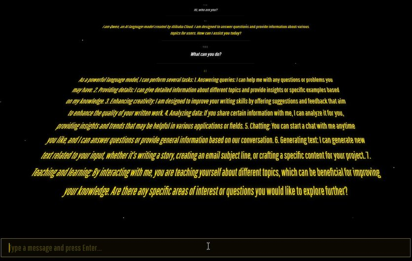

# OLLAMA WARS



A Star Wars opening crawl themed chat interface for Ollama. Your messages appear in white, AI responses in classic Star Wars yellow. Everything scrolls away into the galaxy on a black starfield with a 3D perspective effect.

## Preview

Select a model, hit BEGIN, and start chatting. Every exchange plays out like the opening of a Star Wars film.

## Requirements

- [Ollama](https://ollama.com) installed and running
- At least one model pulled (e.g. `ollama pull llama3.2`)
- A modern browser (Chrome, Firefox, Edge)
- Python 3 (to serve the file locally)

## Getting started

```bash
git clone https://github.com/twietrzykowski/ollama-wars.git
cd ollama-wars
python -m http.server 8080
```

Then open `http://localhost:8080` in your browser.

Make sure Ollama is running before you open the app:

```bash
ollama serve
```

## How it works

The app fetches your locally available models from the Ollama API and lets you pick one. Once you start chatting, messages are rendered in a CSS 3D perspective container that mimics the Star Wars crawl effect. AI responses stream in token by token via the Ollama `/api/chat` endpoint.

No frameworks. No build tools. One HTML file.

## Features

Model selector populated from your local Ollama install. Streaming responses rendered in real time. White text for your messages, yellow for AI. Starfield background. Full conversation history passed to the model for context.

## Author

Tomasz Wietrzykowski
